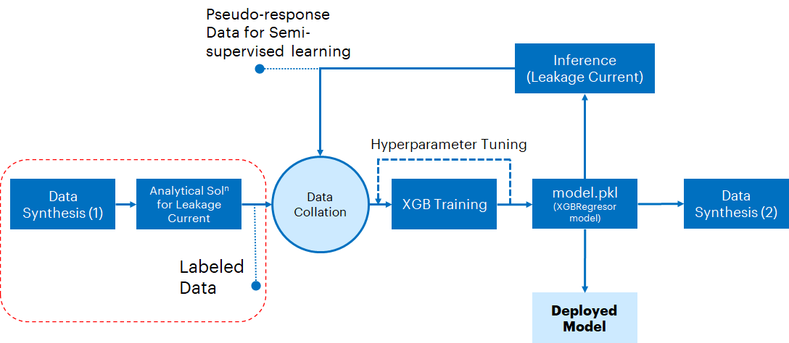
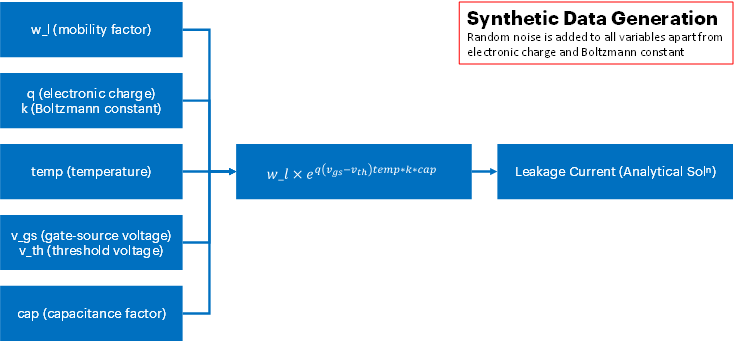
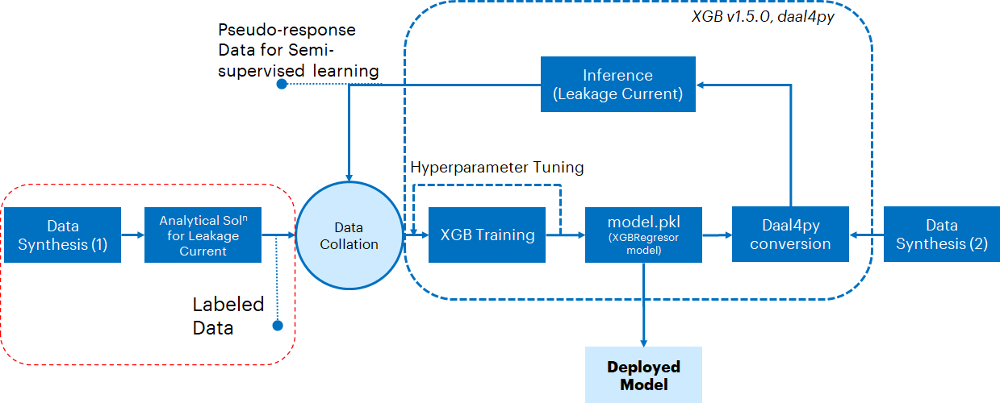
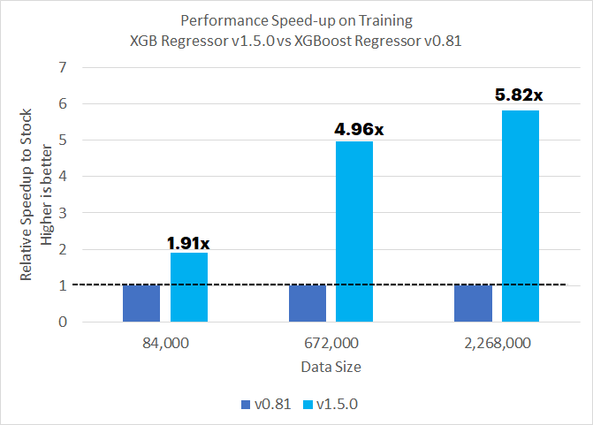
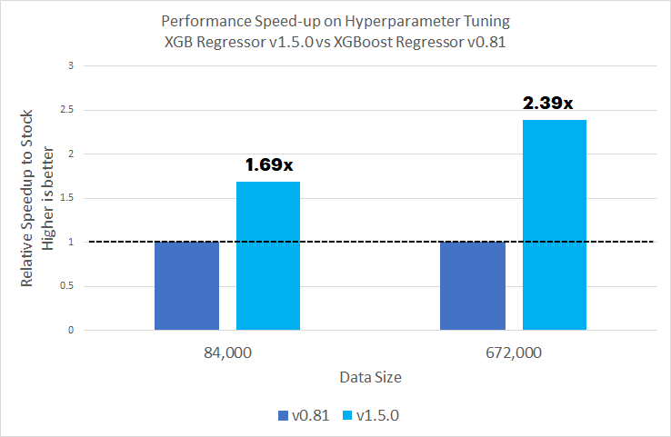
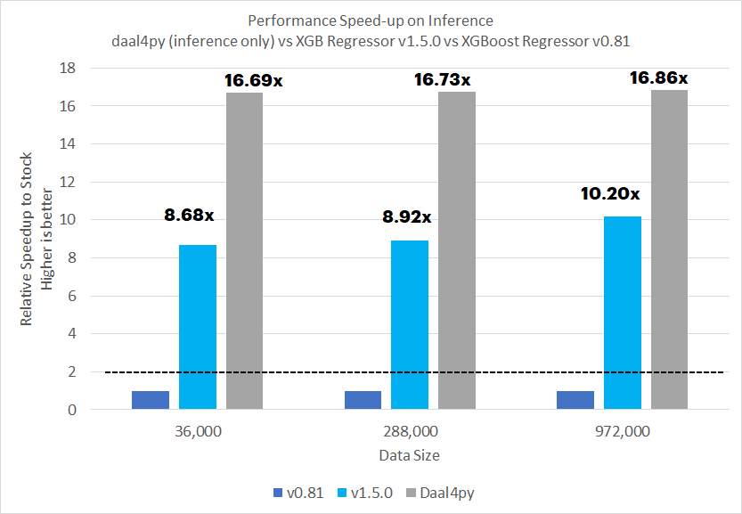
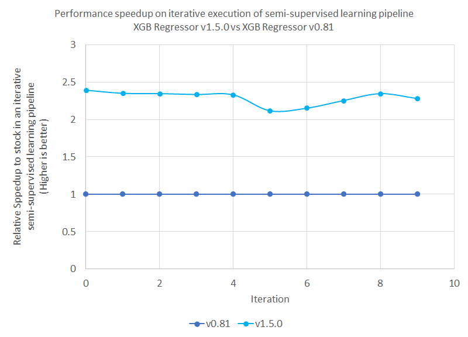

# **Building a MOSFET Digital Twin for Design Exploration: Modeling Sub-threshold Voltage Leakage Current using XGBoostRegressor**
Intel® optimized version (1.5.0) of XGBoost can be used to achieve much quicker training & inference compared to stock version of XGBoost (0.80). In addition to these optimizations, converting a trained gradient boosting model to a daal4py version of the model can further accelerate inference performance.

# **Contents**
 - [Context And Scope](#context-and-scope)
 - [Purpose](#purpose)
 - [Reference Solution](#reference-solution)
 - [Comparing Performance Benefits](#comparing-performance-benefits)
 - [Key Takeaways](#key-takeaways)
 - [Appendix](#Appendix)

## **Context And Scope**
At a very high-level, [Digital Twins](https://en.wikipedia.org/wiki/Digital_twin#:~:text=A%20digital%20twin%20is%20a,testing%2C%20monitoring%2C%20and%20maintenance.) are _in silico_ replicas of physical products, devices or even processes. They can be used as a substitute to expensive testing and experimentation when there is a need to understand or predict a response of their real counterparts when they are subjected to a set of operating conditions or what-if scenarios. This can be extremely handy during product design as well as post-deployment in the field. They can be rendered in a 2D or even a 3D form in applications, programs or interfaces to make them as close to their real counterparts as possible. 

Let's take a wind turbine for example. A block-diagram based graphical environment such as [Simulink](https://www.mathworks.com/help/simulink/index.html) can be used to create a pictoral representation of a wind turbine, which can accept design/input conditions such as wind speed, blade angle, dimensions, material etc. Such a representation will allow a user to interactively provide input these variables and the underlying backend code will calculate the response in the form of RPM, mechanical stress, energy generation etc. Even though this is represented in a visual/interactive form, the backend code will still be analytical equations or AI models generating a response to a series of input variables. This serves as a key purpose of a digital twin. Each response variable will be driven by its own solver or model.

The scope of this reference kit is to build an AI model to provide an approach to model just **one** of several behaviors of a device of choice and demonstrate how Intel oneAPI can optimize that solution. Please note, the scope of this reference kit is not to generate an interactive digital twin in order to simulate the behavior of a device as comprehensively as possible. This reference kit's approach can be enhanced to model other relevant properties and the model(s) can be deployed on s/w like Simulink for the construction of more comprehensive Digital Twins.

## **Purpose**

 For this reference kit we have chosen to model the behavior of Metal-Oxide Substrate Field Effect Transistors (MOSFETs), which are commonly used in consumer electronics and power devices. For MOSFETs the "leakage current" is a key indicator of performance. Hence understanding the how leakage current varies as a function of the input conditions is critical.

 The device includes three components (source, drain and gate). The source-drain current is a function of the operating gate voltage, **v_gs** and the threshold voltage **v_th**. Theoretically, when the **v_gs** is below a threshold **v_th** (**OFF** state), the source drain current _should be_ **zero**. However, there is always a **leakage current** because of several factors. The leakage current can be estimated through analytical equations which do not take into account statistical noise or testing which is often expensive. 

A Machine Learning (ML) solution or an ML-powered MOSFET Digital Twin can be a valuable substitute which will predict leakage current from input values which include **v_th** and **v_gs**. Initial **v_gs** and **v_th** and **leakage_current** data can be collected on millions of MOSFETs. An ML model can be built using this data and can be continuously updated as more data is populated. Essentially this "model" can serve as a digital twin and substitute expensive testing/experimentation. Calculating the sub-threshold leakage of multiple MOSFETs for several voltage levels can help optimize manufacturing as well as monitor performance in the field.

## **Reference Solution**
This section provides key implementation details on of the proposed reference solution for the target use case. It is organized as follows:

1. Proposed reference end-to-end architecture
2. Setting up the stock environment
3. Executing reference architecture pipeline components (training, hyperparameter tuning, inference, semi-supervised learning)
4. Optimizing the reference solution pipeline using Intel packages


### **Proposed Reference Architecture**
A schematic of the proposed reference architecture is shown in the following figure. The portion of the diagram enclosed in the red dashed line is the section of the workload for generating the synthetic data. 

Below the entire reference architecture diagram, there is an expanded schematic which describes how the leakage current is calculated from voltage values and other parameters.

In addition to the standard training/hyperparameter tuning/prediction sections of an ML pipeline, we will also build a semi-supervised learning component to enable continuous learning. Here we will start by training a conventional ML model and then use it to create pseudo-response values for non-training, synthetic data. Both the original and synthetic pseudo-response data will be combined and used to train a "semi-supervised" model.

This process can continue iteratively to _simulate_ self-learning - similar to a digital twin - from influx of "fresh" data from devices. The model.pkl file is the XGBRegressor model which will be stored to be later used for inferencing. 

Once the development exercise is complete, the final model can then be deployed into production and used as a digital replica of a MOSFET device for simulating leakage behavior of a real device OR can be used as one of the componets to build a more complex Digital Twin system.

**Note:** The proposed reference solution is built primarily using an XGBoost Regressor. However, separate experiments were conducted using a Linear Regressor to serve as a reference point for Mean Squared Error (MSE) values and confirm that XGBoost outperforms a simple Linear Regressor. Actual MSE numbers are mentioned in the section for [Comparing Performance Benefits](#comparing-performance-benefits)





### **Stock Packages Used**
- Python v3.9
- Pandas v1.4.2
- NumPy v1.22.4
- XGBoost v0.81
- Scikit-learn v1.1.1

### **Setting up Stock Environment**

To execute the scripts provided in the reference kit, you will need to work on the Anaconda platform. Download and installation instructions for a Linux machine can be found [here](https://docs.anaconda.com/anaconda/install/linux/)

Once Anaconda is installed, clone the git repository using the following command:
```shell
git clone https://www.github.com/oneapi-src/digital-twin
```

Once the repo is cloned, navigate to the parent directory. The script `setupenv.sh` is provided to automate the setup of the conda environments necessary. In the parent directory, execute the following command:

```shell
./setupenv.sh
```
>*Note: Depending on your machine settings, you may need to run the command `chmod +x ./setupenv.sh` prior to running the `./setupenv.sh` command in order to properly execute it.*

This will prompt for the selection of stock/intel packages. Select 1 for stock.

Example option selection for creating stock/intel environement as given below

```shell
Select technology distribution:
    1. stock
    2. intel
```
Once the environment is setup, activate the stock environment using the following command.

```shell
conda activate MOSFET_stock
```
You can then move ahead to executing the pipeline using stock packages

### **Data Ingestion**

For this reference kit, there is no data that needs to be loaded from an external source. Synthetic data is generated as part of the source code. The relevant functions for data generation are located in the file *synthetic_datagen.py* and which is called from *MOSFET_v5_ML.py* during code execution, that is described in the following sections. The synthetic data will have 9 columns where 8 of the columns are features that are used for training and 1 column is the response or prediction, which is the logarithm of sub-threshold voltage leakage current.

### **Training/Hyperparameter Tuning/Inference**

Once we create and activate the virtual environment, we can run the benchmarks for evaluating performance gain. The training and inference portion of benchmarking can be run using the python script `MOSFET_v5_ML.py`.

The script **generates the synthetic data**, **performs low-level feature engineering**, **trains an XGBoostRegressor model**, and **performs inference on the trained model**. It also reports the time taken to perform model training and inference. With the right argument, the script can also **perform hyperparameter tuning**. 

> Before running the script, we need to ensure that the appropriate conda environment is activated.

The run benchmark script takes the following arguments:

```shell
usage: MOSFET_v5_ML.py [-h] [-l LOGFILE] [-i] [-m model] [-mf modelfile] [-n n_data_len]

arguments:
  -h, --help            show this help message and exit
  -l, --logfile         log file to output benchmarking results to
  -i, --intel           use intel accelerated technologies where available
  -m, --model           provide model type (lr for LinearRegression, xgb for XGBoost, 
                                            xgbh for XGBoost with hyperparameter tuning)
  -mf,  --modelfile      provide model file name to dump the trained model
  -n, n_data_len         parameter which decides data length (120,960,3240K). Provide 1,2, or 3
```

To run with stock set-up while logging the performance to `logs`, we would run in the parent directory (after creating the appropriate environment as above):
```shell
python ./src/MOSFET_v5_ML.py -m xgb -mf MOSFET_XGB_stock_120000.pkl -l ./logs/XGB_stock.log -n 1
```

The log file name can be changed to describe the run. In this example, the name of the log is `XGB_stock.log`. **Please note** the log file dump will **not** create a new log file everytime. If a log file currently exists with the inputted name, the code will keep on appending result logs to the existing file.

To conduct hyperparameter tuning, just change the `-m` argument input to **xgbh** instead of **xgb** and provide the correct log file path.

So far, we have not discussed semi-supervised learning which is triggered during full pipeline execution. The full pipeline execution is simulating how inference can be run on fresh data to create pseudo-response data. In real life, the continuous data stream would be coming from the field where MOSFET devices are deployed or from tests conducted as part of manufacturing. In our case though, it is synthetic. The, "fresh" pseudo-response data can then be appended to the existing training dataset to create an "augmented" training dataset. The digital twin model then can be revised using the augmented training dataset. This process is carried out iteratively in the file _MOSFET_v5_ML.py_. 

**Please note** that the data is length for the full pipeline execution is capped at 2.5M. In addition to the standard log, a csv file (train_time_stock.csv or train_time_intel.csv) will be dumped in the parent directory.

To execute the full pipeline, just change the `-m` argument input to **xgbfull** instead of **xgb** and provide the correct log file path as follows:

```shell
python ./src/MOSFET_v5_ML.py -m xgbfull -l ./logs/XGBfull_stock.log -n 2
```

#### **Expected Output**

The script will generate the following outputs:
1. After the execution of training/hyperparameter tuning benchmarks, the script will dump an XGBoost Regressor Model (.pkl) file in the working directory. The generated model is used subsequently in the same script for running inference.
2. The inference output will be a continuous response variable which will be the predicted logarithm of the leakage current as well as the MSE values based on the actual logarithm of the leakage current. _However, only the benchmarking time and MSE value is reported in the log file._
3. For the full pipeline execution, in addition to the log file, a csv file (train_time_stock.csv or train_time_intel.csv) will be dumped in the parent directory. This tracks the training dataset length after each iteration as well as the time it took to train an XGBoost Regression model for that dataset. We will plot the trend in the results section. The data length is capped at 2.5M rows.

## **Optimizing the Reference Solution using Intel Packages**

The reference solution architecture for an Intel-optimized version of the pipeline is largely unchanged except for the execution using training and inference Intel optimizations for XGBoost and the use of additional inference optimizations from the daal4py module. Input data is generated using the same analytical principles. The trained model will be converted to a daa4py version to use Intel optimizations. This leads to a much faster inference performance. In a hypothetical "deployment" situation, the original model will be deployed but in order to avail daal4py optimizations inference must always be run post-daal4py conversion. <br>




### **Intel Packages Used**
- Python v3.9
- Pandas v1.3.5
- numpy v1.21.4
- XGBoost v1.5.0
- scikit-learn v0.24.2
- Intel Extension for Scikit-Learn v2021.6.0
- daal4py v2021.6.0

#### **Intel® Extension for Scikit-Learn**
Intel® Extension for Scikit-Learn is part of the larger Intel® AI Analytics Toolkit, and powered by the Intel® oneAPI Data Analytics Library (oneDAL). It offers significant performance boost over analytics, training and inference of the standard classical ML algorithms and analytics such as train test split, regressions, classification, random forests, decision trees, etc. 

#### **XGBoost v1.5.0**
XGBoost v1.5.0 will offer Intel optimized training and inference performance over stock XGBoost. Post v0.81 Intel optimizations have been already upstreamed in the standard release versions. As a result, no additional code changes are needed to use the optimized versions. **Please keep in mind** that to train an XGBoost model using Intel optimizations that the 'tree_method' parameter should be set to 'hist'.

#### **daal4py**

daal4py is the Python API for the Intel® oneAPI Data Analytics Library (oneDAL), and it is a part of the larger Intel® AI Analytics Toolkit. daal4py has the ability to easily convert trained XGBoost and LightGBM models to offer significant advantage in inference compared to stock inferencing _without accuracy loss_. This can be vital while serving a model on an edge location which has to handle a high influx of requests from a client.

### **Setting up Intel Environment**

Follow the same instructions as the ones for setting up a stock environment. Execute the following command:

```shell
./setupenv.sh
```
>*Note: Depending on your machine settings, you may need to run the command `chmod +x ./setupenv.sh` prior to running the `./setupenv.sh` command in order to properly execute it.*

This will prompt for the selection of stock/intel packages. Select 2 for intel.

```shell
Select technology distribution:
    1. stock
    2. intel
```
Once the environment is setup, activate the intel environment using the following command.

```shell
conda activate MOSFET_intel
```
You can then move ahead to executing the pipeline using intel packages

### **Training/Hyperparameter Tuning/Inference**

Once we create and activate the virtual environment, we can run the benchmarks for evaluating performance gain. The training and inference portion of benchmarking can be run using the python script `MOSFET_v5_ML.py`.

The script **generates the synthetic data**, **performs low-level feature engineering**, **trains an XGBoostRegressor model**, **performs inference on the trained model**. It also reports the time taken to perform model training and inference. With the right argument, the script can also **perform hyperparameter tuning**. 

> Before running the script, we need to ensure that the appropriate conda environment is activated.

The run benchmark script takes the following arguments:

```shell
usage: MOSFET_v5_ML.py [-h] [-l LOGFILE] [-i] [-m model] [-mf modelfile] [-n n_data_len]

arguments:
  -h, --help            show this help message and exit
  -l, --logfile         log file to output benchmarking results to
  -i, --intel           use intel accelerated technologies where available
  -m, --model           provide model type (lr for LinearRegression, xgb for XGBoost, 
                                            xgbh for XGBoost with hyperparameter tuning)
  -mf,  --modelfile      provide model file name to dump the trained model
  -n, n_data_len         parameter which decides data length (120,960,3240K). Provide 1,2, or 3
```

To run with Intel technologies, logging the performance to `logs`, we would run in the parent directory (after creating the appropriate environment as above):
```shell
python ./src/MOSFET_v5_ML.py -i -m xgb -mf MOSFET_XGB_intel_120000.pkl -l ./logs/XGB_intel.log -n 1
```

The log file name can be changed to describe the current run. **Please note** the log file dump will **not** create a new log file everytime. If a log file currently exists with the inputted name, the code will keep on appending logs to the existing file.

To conduct hyperparameter tuning, just change the -m argument input to **xgbh** instead of **xgb** and provide the correct log file path.

For the full pipeline execution, just change the -m argument input to **xgbfull** instead of **xgb** and provide the correct log file path as follows: 

```shell
python ./src/MOSFET_v5_ML.py -i -m xgbfull -l ./logs/XGBfull_intel.log -n 2
```

The only difference here is that a daal4py version of the XGBoost Regressor model will be used to create pseudo-response data.

**Please note** that the data is length for the full pipeline execution is capped at 2.5M. In addition to the standard log, a csv file (train_time_stock.csv or train_time_intel.csv) will be dumped in the parent directory.


## **Comparing Performance Benefits**

In this section, we illustrate the benchmarking results comparing the Intel® technologies vs the stock alternatives.  We break it down into the following tasks of this ML pipeline:

  1. Training an XGBoost model using stock and Intel-optimized packages
  2. Hyperparameter tuning an XGBoost model using stock and Intel-optimized packages
  3. Predicting outcomes over batch data using an XGBoost model trained using stock technologies and a model converted to do daal4py gradient boosting inference
  4. Enhancing the pipeline to incorporate an iterative semi-supervised learning approach

Following are key observations from the results:

  1. For the data sizes tested, an XGB Regressor, v1.5.0 offers up to 5.82x more speedup than v0.81 for training and up to 2.39x more speedup on hyperparameter tuning
  2. For inference post training, XGBoost v1.5.0 offers up to 10.2x more speedup over v0.81. daal4py makes inference 1.65-1.92x faster over XGBoost v1.5.0. This makes using the optimized packages to up to 16.86 faster over using stock packages

#### **Note on MSE Values**
MSE values for a Linear Regression model were ~0.42. For an XGBoost regressor MSE values were always less than 0.033. This shows that an XGBoost Regressor outperforms a Linear Regression model in terms of accuracy

#### **Note on benchmarking results**
As mentioned before, Intel has upstreamed XGBoost optimizations to the standard release. As a result an older version v0.81 was chosen as the stock package. Please keep in mind the performance benefit will be a result of both Intel Optimizations as well as version updates.

On the other hand, daal4py gain over XGBoost v1.5.0 is purely due to Intel optimizations as part of the oneDAL library.


<br>
1. Training an Intel-optimized XGB Regressor model relative to stock XGB Regressor




2. Hyperparameter tuning on an Intel-optimized XGB Regressor model relative to stock XGB Regressor 



3. Inference on an Intel-optimized XGB Regressor model and daal4py model conversion inference relative to stock XGB Regressor 



4. Executing a Semi-Supervised ML (xgbfull) pipeline

Once the individual components of a standard ML pipeline are executed using labeled data, we can use the model to run inference on "fresh" data to generate pseudo-response (PR) data. This data can then be collated with the original dataset, which can then be used to train a semi-supervised model. We repeated this process iteratively, increasing the dataset each time based on the value set for `n`,  for 10 passes with the total possible data size capped at 2.5M data samples. The time for training each revised version of the model is tracked and dumped as a csv as a function of iteration count. Each run (stock and intel) will result in a separate csv file (`train_time_stock.csv` or `train_time_intel.csv` for stock and intel runs respectively). The data from both files can then be consolidated into a single chart that is shown in the following plot. It compares the training-only timeframes for executing the semi-supervised learning pipeline for Intel optimizations for XGBoost vs stock packages. 

The larger objective of this chart is to demonstrate how Intel optimized packages can help a digital twin self-learn faster than using stock packages over time.




From the chart above, we notice that there is an initial increase in the training time due to the data size increasing as more pseudo-response data is added to the response data. But the increase plateaus off as the data size cap is reached. During the iterative process, there is a 2.1-2.35x speedup observed in model training if we compare Intel XGBoost vs stock XGBoost
<br>

## **Key Takeaways**

An Intel-optimized version of XGBoost offers significant advantage over the unoptimized version in terms training, hyperparameter tuning as well as inference. Performance gains in training tend to increase with datasize whereas inference gains stay relatively constant. In addition to these optimizations, using **daal4py optimizations for inference conversion of a pre-trained XGBoost model** offers an added up to **1.92x** speedup **in inference performance** over using just the Intel-optimized version, therefore taking the total gains from optimizations to up to **16.82x** over stock technologies. 

We also explored a semi-supervised learning pipeline for continuous learning, where we saw performance through the iterative process to be **2.1-2.35x** faster training performance of Intel XGBoost over stock XGBoost.

To put this in more context, a digital twin is supposed to continuously learn from new information in order to match the functioning of its real counterpart as closely as possible.  The semi-supervised learning approach presented here is one way of doing that. Hence, any performance gain which makes that process faster - such as using Intel Optimizations for XGBoost and daal4py in this case - is going to make the digital twin more responsive to new information.


## **Appendix**

### **Experiment Setup**

| **Configuration**:                | **Description**
| :---                              | :---
| Platform                          | Microsoft Azure: Standard_D8s_v5 (IceLake) <br> Ubuntu 20.04
| Processing Hardware               | Intel IceLake CPU
|  Software                          | XGBoost (stock_version: 0.81; intel_version: 1.5.0) <br> Pandas (stock_version: 1.4.2, intel_version:1.3.5) <br> Scikit-learn (stock_version: 1.1.1) <br> Scikit-learn (intel_version: 0.24.2) <br> Intel Extension for Scikit-Learn* (2021.6.0) <br> daal4py(2021.6.0)
| What you will learn               | **1.** Intel® oneAPI performance advantage over the stock versions of XGBoost on model training and inference. <br>**2.** daal4py performance advantage on gradient boosting model inference

Intel has released XGBoost optimizations as part of the general XGBoost packages. Please keep in mind the performance benefit will be a result of both Intel Optimizations as well as version updates. No code changes are needed to realize these performance gains apart from just updating the XGBoost version, except for explicitly listing tree_method as hist (as all training optimizations from Intel are limited to the hist tree method). However, the **daal4py** optimizations are still relevant to the use case as this can further improve the performance of end-user applications. 

Because MOSFET devices are so common, any performance gain in model development will be amplified significantly in a deployed model. This offers a significant advantage in model solution scalability. Because leakage current is a key indicator of performance, a digital twin which can predict the leakage current of MOSFET devices _at scale_ will be extremely valuable. To deploy this solution, the model.pkl file which is created as a result of training/hyperparameter tuning can be used to create the end-user applications (APIs to handle client requests) through standard OS packages such as flask or FastAPI. 

The base code was sourced from the following github repository:
https://github.com/tirthajyoti/Digital-Twin/blob/main/MOSFET-1.ipynb

**Operating System:**
We recommend using an Linux OS for executing the reference solution presented here, e.g. RHEL or Ubuntu.

## **Notes**

**The dataset used here is synthetic. Intel Corporation does not own the rights to this data set and does not confer any rights to it.**


